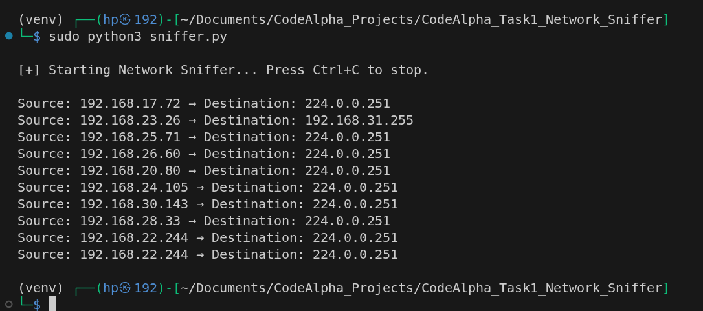
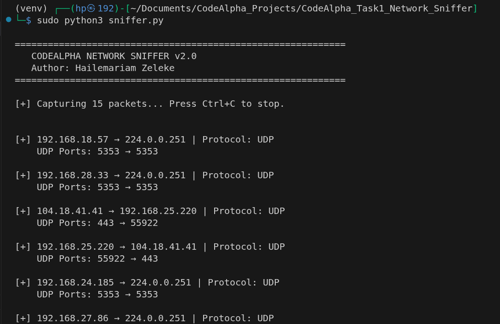
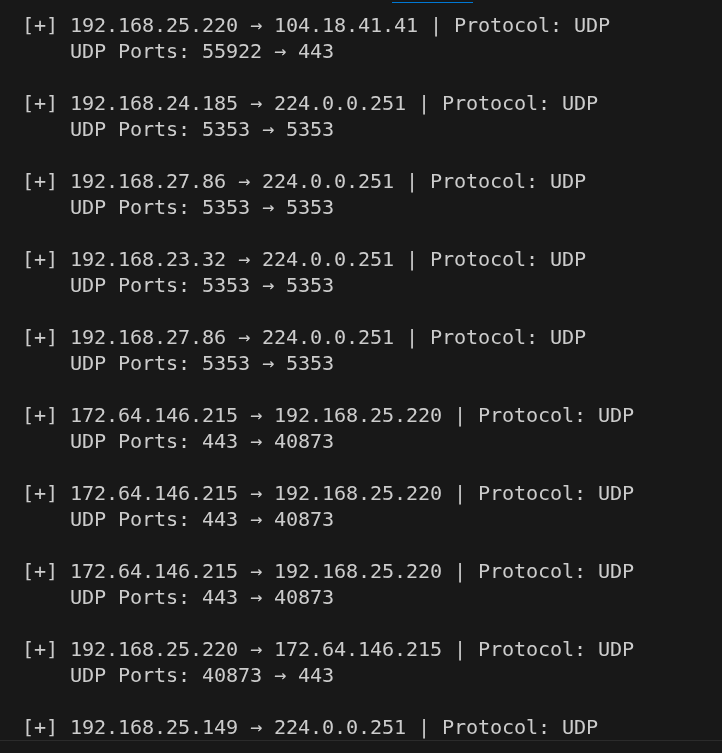
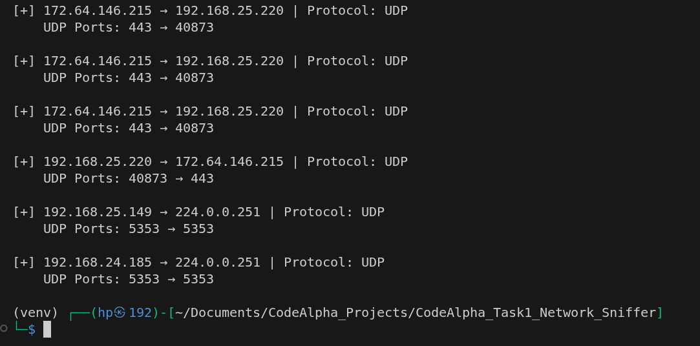
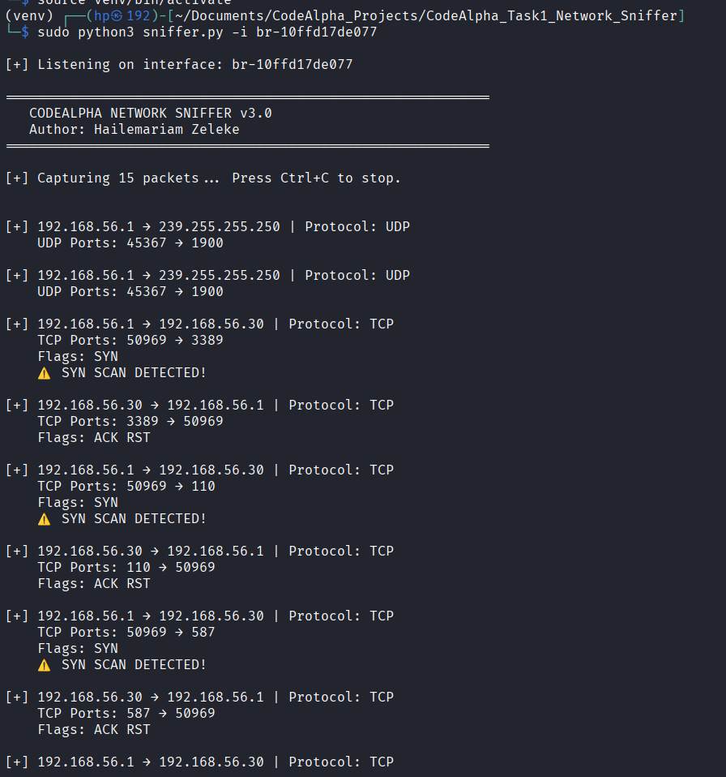
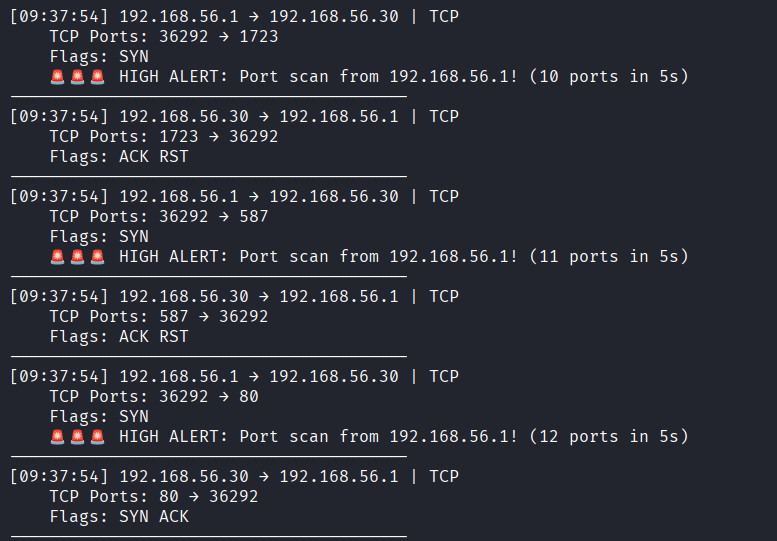
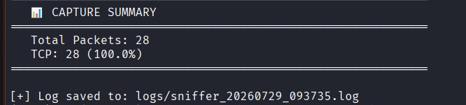
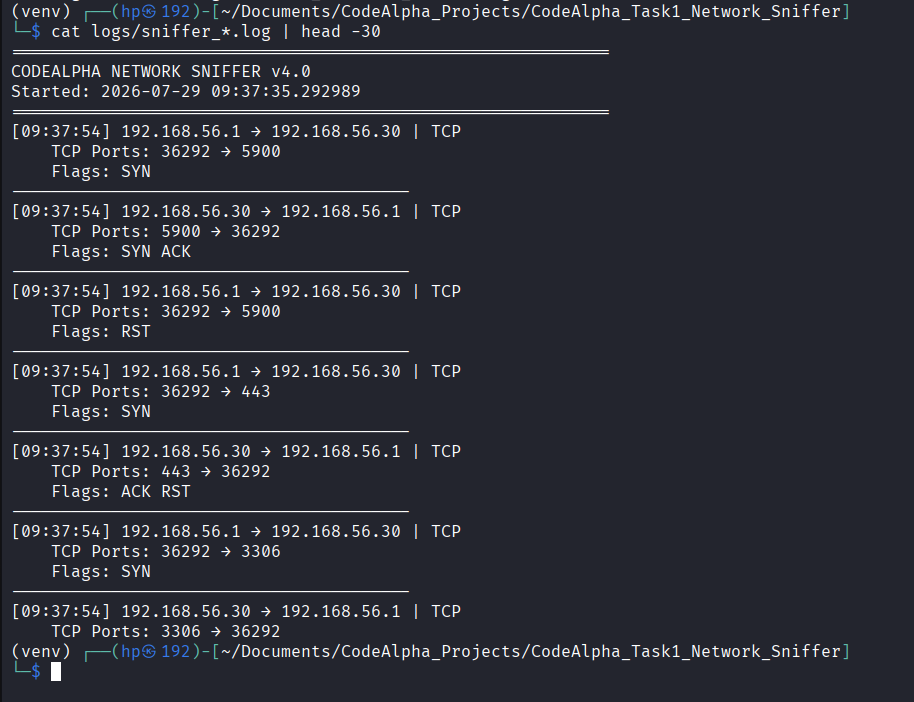
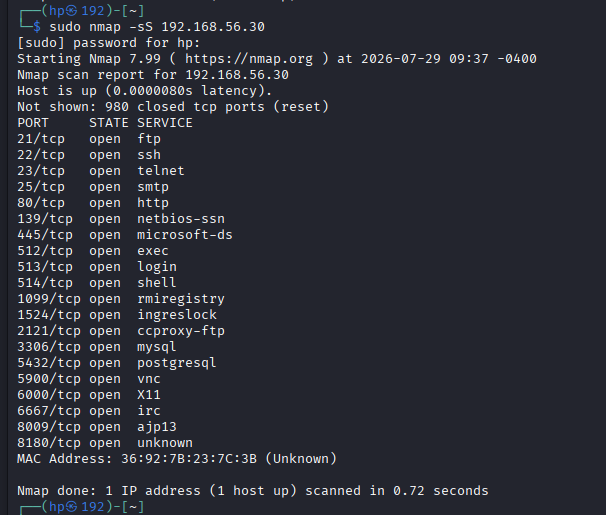

# Network Packet Sniffer with Port-Scan Detection

A Python network sniffer built with **Scapy** that captures live traffic, decodes IP, TCP, UDP and ICMP packets, and detects **Nmap-style SYN port scans** in real time using threshold-based analysis. Developed as **Task 1 of the CodeAlpha Cybersecurity Internship**.


---

## Features

- **Live packet capture** on any network interface (`-i wlan0`, `-i eth0`, `-i lo`)
- **Protocol decoding:** source/destination IP, TCP/UDP ports, ICMP message types
- **TCP flag analysis:** SYN, ACK, RST, FIN, PSH, URG
- **Payload inspection:** preview of the first 200 characters of plaintext payloads (e.g. HTTP)
- **SYN port-scan detection:** alerts when one host probes **10 or more ports within 5 seconds**
- **Capture statistics:** packet totals and protocol distribution
- **Automatic logging:** every session is saved to a timestamped file in `logs/`

## How It Works

1. `scapy.sniff()` captures packets from the selected interface and passes each one to `analyze_packet()`.
2. The IP layer is parsed, followed by the TCP, UDP or ICMP layer.
3. TCP flags are decoded with bit masks (`0x02` = SYN, `0x10` = ACK, `0x04` = RST, …).
4. **Scan detection:** for every SYN-only packet, the tool records `(timestamp, destination port)` per source IP in a **5-second sliding window**. When the number of unique ports reaches the threshold, it raises a `HIGH ALERT` and writes it to the log.
5. After the capture, a protocol summary is printed and saved.

Detection sensitivity is configurable at the top of `sniffer.py`:

```python
SYN_THRESHOLD = 10   # unique ports that trigger an alert
SYN_WINDOW = 5       # time window in seconds
```

## Requirements

- Linux (tested on Kali Linux)
- Python 3.8+
- Root privileges (required for raw packet capture)
- [Scapy](https://scapy.net/)

## Installation

```bash
git clone https://github.com/HailshZ/CodeAlpha_Task1_Network_Sniffer.git
cd CodeAlpha_Task1_Network_Sniffer

python3 -m venv venv
./venv/bin/pip install -r requirements.txt
```

## Usage

```bash
# List network interfaces
ip -br link

# Capture on a specific interface
sudo ./venv/bin/python sniffer.py -i wlan0

# Capture on the default interface
sudo ./venv/bin/python sniffer.py
```

Each run captures **30 packets**, prints a summary and saves the log to `logs/sniffer_<date>_<time>.log`.

### Testing scan detection (lab environment)

```bash
# Terminal 1: monitor the loopback interface
sudo ./venv/bin/python sniffer.py -i lo

# Terminal 2: run a SYN scan against your own machine
sudo nmap -sS -p 1-100 127.0.0.1
```

## Sample Output

Captured during an Nmap SYN scan in an isolated lab network:

```
[09:37:54] 192.168.56.1 → 192.168.56.30 | TCP
    TCP Ports: 36292 → 1723
    Flags: SYN
    🚨🚨🚨 HIGH ALERT: Port scan from 192.168.56.1! (10 ports in 5s)
----------------------------------------
[09:37:54] 192.168.56.30 → 192.168.56.1 | TCP
    TCP Ports: 1723 → 36292
    Flags: ACK RST
----------------------------------------
```

The scanner (`192.168.56.1`) sent a SYN to port 1723, the tenth port within five seconds, which triggered the alert. The target replied with `ACK RST`, indicating the port is closed.

## Screenshots

The screenshots document the tool's development from a basic capture (v1) to threshold-based detection (v4).

| | |
|---|---|
| **Basic packet capture (v1)**<br> | **Protocol and port decoding (v2)**<br> |
| **UDP traffic analysis**<br> | **Completed capture session**<br> |
| **Per-packet SYN detection (v3)**<br> | **Threshold-based HIGH ALERT (v4)**<br> |
| **Capture summary**<br> | **Session log file**<br> |
| **Nmap SYN scan used for testing**<br> | |

## Project Structure

```
CodeAlpha_Task1_Network_Sniffer/
├── sniffer.py          # Packet capture, decoding and scan detection
├── requirements.txt    # Python dependencies (Scapy)
├── screenshots/        # Documentation screenshots
├── logs/               # Session logs (created at runtime, not tracked)
└── LICENSE
```

## Limitations and Future Work

| Current limitation | Planned improvement |
|---|---|
| Fixed capture of 30 packets per run | Command-line packet count and continuous mode |
| Detects SYN scans only | Detection of FIN, NULL, Xmas, UDP and slow scans |
| Alerts repeat for every packet after the threshold | Per-source alert cool-down |
| IPv4 only | IPv6 and ARP support (e.g. ARP-spoofing detection) |
| Text logs only | Export to `.pcap` for analysis in Wireshark |
| Detection only (IDS) | Optional automatic blocking via `iptables` (IPS) |

Encrypted payloads (HTTPS/TLS) can't be read by design. Payload previews are meaningful only for plaintext protocols.

## Ethical Use

This tool is intended for **education and authorized testing only**. Capture traffic and run scans only on networks and systems you own or have explicit written permission to test.

## Author

**Hailemariam Zeleke**
Full Stack Developer | Ethical Hacker
[Portfolio](https://hailemariamzelekeportfolio.netlify.app) · [GitHub](https://github.com/HailshZ) · [LinkedIn](https://www.linkedin.com/in/hailemariam-zeleke-38178329a)

## License

Released under the [MIT License](LICENSE).
